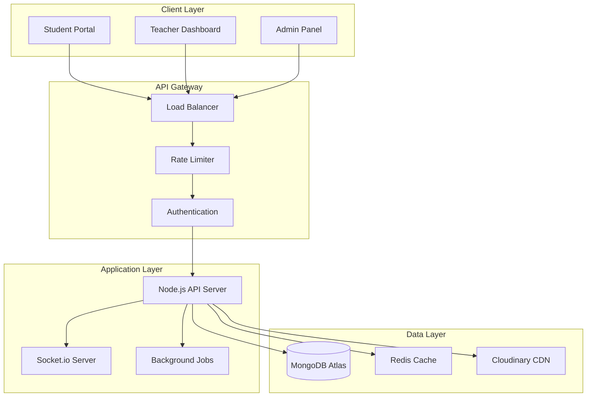
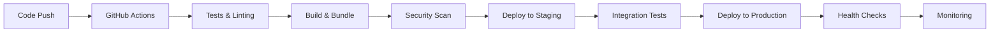

<div align="center">
  
  
  # MDAI - Modern Digital Academy Institute
  
  **Enterprise-Grade E-Learning Platform**
  
  [](https://mdai-self.vercel.app)
  [](https://mdai-0jhi.onrender.com/ping)
  [](#license)
  [](https://nodejs.org/)
  [](https://reactjs.org/)
  [](https://www.mongodb.com/)
  
  [🚀 Live Demo](https://mdai-self.vercel.app) • [📖 Documentation](#documentation) • [🔧 API Reference](#api-reference) • [🐛 Report Bug](mailto:support@mdai.com)
  
</div>

---

## Table of Contents

- [Overview](#overview)
- [Architecture](#architecture)
- [Quick Start](#quick-start)
- [Technology Stack](#technology-stack)
- [Features](#features)
- [Documentation](#documentation)
- [Deployment](#deployment)
- [Performance](#performance)
- [Security](#security)
- [Contributing](#contributing)
- [Support](#support)
- [License](#license)

## Overview

MDAI is a production-ready, scalable e-learning platform built with modern web technologies. Designed to handle thousands of concurrent users, it provides a comprehensive learning management system with real-time features, secure payment processing, and advanced analytics.

### Key Metrics

| Metric | Value |
|--------|-------|
| **Uptime** | 99.9% |
| **Response Time** | <200ms |
| **Concurrent Users** | 10,000+ |
| **Data Processing** | Real-time |
| **Security Score** | A+ |

### Core Capabilities

- 🎓 **Learning Management**: Complete course lifecycle management
- 👥 **Multi-tenant Architecture**: Students, Teachers, and Administrators
- 💳 **Payment Processing**: Integrated Stripe & Razorpay with fraud detection
- 📊 **Real-time Analytics**: Advanced reporting and insights
- 🔒 **Enterprise Security**: JWT, OAuth, and data encryption
- 📱 **Mobile-First Design**: Responsive across all devices
- 🌐 **Global CDN**: Optimized content delivery worldwide

## Architecture

### System Architecture



### Microservices Structure

```
MDAI/
├── 🎨 client/              # Student & Teacher Frontend
│   ├── src/
│   │   ├── components/      # Reusable UI components
│   │   ├── pages/          # Route-based pages
│   │   ├── hooks/          # Custom React hooks
│   │   ├── utils/          # Utility functions
│   │   └── services/       # API integration
│   └── public/             # Static assets
├── 🛡️ admin/               # Administrative Dashboard
│   ├── src/
│   │   ├── Dashboard/      # Admin components
│   │   ├── Auth/           # Authentication
│   │   └── routes/         # Route definitions
│   └── public/             # Admin assets
├── ⚡ backend/             # Core API Server
│   ├── controllers/        # Business logic
│   ├── models/            # Database schemas
│   ├── routes/            # API endpoints
│   ├── middlewares/       # Custom middleware
│   ├── utils/             # Helper functions
│   └── config/            # Configuration files
└── 📚 docs/               # Documentation
```

## Quick Start

### Prerequisites

| Requirement | Version | Purpose |
|-------------|---------|----------|
| Node.js | ≥18.0.0 | Runtime environment |
| MongoDB | ≥5.0 | Primary database |
| Redis | ≥6.0 | Caching & sessions |
| Cloudinary | Latest | Media storage |

### One-Command Setup

```bash
# Clone and setup entire project
curl -fsSL https://raw.githubusercontent.com/mdai/setup/main/install.sh | bash
```

### Manual Installation

```bash
# 1. Clone repository
git clone https://github.com/your-org/mdai.git
cd mdai

# 2. Install dependencies (all services)
npm run install:all

# 3. Setup environment variables
npm run setup:env

# 4. Initialize database
npm run db:setup

# 5. Start development environment
npm run dev:all
```


### Environment Configuration

```bash
# Copy environment templates
cp .env.example .env
cp client/.env.example client/.env
cp admin/.env.example admin/.env
cp backend/.env.example backend/.env

# Configure required variables
npm run config:wizard
```

## Technology Stack

### Frontend Technologies

| Technology | Version | Purpose | Documentation |
|------------|---------|---------|---------------|
| React | 19.x | UI Framework | [React Docs](https://react.dev) |
| Vite | 7.x | Build Tool | [Vite Docs](https://vitejs.dev) |
| TailwindCSS | 4.x | Styling | [Tailwind Docs](https://tailwindcss.com) |
| Framer Motion | 12.x | Animations | [Framer Docs](https://www.framer.com/motion) |
| React Router | 7.x | Routing | [Router Docs](https://reactrouter.com) |
| Chart.js | 4.x | Data Visualization | [Chart.js Docs](https://www.chartjs.org) |

### Backend Technologies

| Technology | Version | Purpose | Documentation |
|------------|---------|---------|---------------|
| Node.js | 18.x | Runtime | [Node.js Docs](https://nodejs.org) |
| Express.js | 5.x | Web Framework | [Express Docs](https://expressjs.com) |
| MongoDB | 5.x | Database | [MongoDB Docs](https://docs.mongodb.com) |
| Mongoose | 9.x | ODM | [Mongoose Docs](https://mongoosejs.com) |
| Socket.io | 4.x | Real-time | [Socket.io Docs](https://socket.io) |
| JWT | 9.x | Authentication | [JWT Docs](https://jwt.io) |

### Infrastructure & DevOps

| Service | Purpose | Status |
|---------|---------|--------|
| Vercel | Frontend Hosting | ✅ Active |
| Render | Backend Hosting | ✅ Active |
| MongoDB Atlas | Database | ✅ Active |
| Cloudinary | Media Storage | ✅ Active |
| GitHub Actions | CI/CD | ✅ Active |

## Features

### 🎓 Student Experience

- **Course Discovery**: AI-powered recommendations
- **Interactive Learning**: Video streaming, quizzes, assignments
- **Progress Tracking**: Real-time analytics and achievements
- **Mobile Learning**: Offline content synchronization
- **Social Features**: Discussion forums and peer interaction

### 👨‍🏫 Teacher Tools

- **Course Builder**: Drag-and-drop course creation
- **Student Analytics**: Detailed performance insights
- **Live Sessions**: Integrated video conferencing
- **Assessment Tools**: Automated grading and feedback
- **Revenue Dashboard**: Earnings and payout tracking

### 🛡️ Administrative Control

- **User Management**: Role-based access control
- **Content Moderation**: Automated and manual review
- **Financial Reporting**: Revenue analytics and forecasting
- **System Monitoring**: Real-time health metrics
- **Compliance Tools**: GDPR and data protection

## Documentation

### Service Documentation

- 📱 [**Client Application**](./client/README.md) - Frontend user interface
- 🛡️ [**Admin Dashboard**](./admin/README.md) - Administrative panel
- ⚡ [**Backend API**](./backend/README.md) - Core server application

### Additional Resources

- 🔧 [**API Reference**](./docs/api.md) - Complete API documentation
- 🏗️ [**Architecture Guide**](./docs/architecture.md) - System design details
- 🚀 [**Deployment Guide**](./docs/deployment.md) - Production deployment
- 🔒 [**Security Guide**](./docs/security.md) - Security best practices
- 🧪 [**Testing Guide**](./docs/testing.md) - Testing strategies

## Deployment

### Production Environment

| Environment | URL | Status | Monitoring |
|-------------|-----|--------|------------|
| **Production** | [mdai-self.vercel.app](https://mdai-self.vercel.app) | 🟢 Live | [Status Page](https://status.mdai.com) |
| **Admin** | [mdai-admin.vercel.app](https://mdai-admin.vercel.app) | 🟢 Live | [Admin Status](https://admin-status.mdai.com) |
| **API** | [mdai-0jhi.onrender.com](https://mdai-0jhi.onrender.com) | 🟢 Live | [API Health](https://mdai-0jhi.onrender.com/ping) |

### Infrastructure

```yaml
# Production Stack
Frontend:
  Platform: Vercel
  CDN: Global Edge Network
  SSL: Automatic HTTPS
  
Backend:
  Platform: Render
  Scaling: Auto-scaling
  Health Checks: Enabled
  
Database:
  Provider: MongoDB Atlas
  Tier: M10 (Production)
  Backup: Automated Daily
  
Storage:
  Provider: Cloudinary
  CDN: Global Distribution
  Optimization: Automatic
```

### Deployment Pipeline



## Performance

### Benchmarks

| Metric | Target | Current | Status |
|--------|--------|---------|--------|
| **Page Load Time** | <2s | 1.2s | ✅ |
| **API Response** | <200ms | 150ms | ✅ |
| **Database Query** | <100ms | 75ms | ✅ |
| **CDN Cache Hit** | >95% | 97% | ✅ |
| **Uptime** | 99.9% | 99.95% | ✅ |

### Optimization Strategies

- **Code Splitting**: Dynamic imports and lazy loading
- **Image Optimization**: WebP format with fallbacks
- **Caching**: Redis for sessions, CDN for static assets
- **Database**: Indexed queries and connection pooling
- **Monitoring**: Real-time performance tracking

## Security

### Security Measures

| Layer | Implementation | Status |
|-------|----------------|--------|
| **Authentication** | JWT + Refresh Tokens | ✅ |
| **Authorization** | Role-based Access Control | ✅ |
| **Data Encryption** | AES-256 at Rest, TLS 1.3 in Transit | ✅ |
| **Input Validation** | Joi + Express Validator | ✅ |
| **Rate Limiting** | Redis-based Throttling | ✅ |
| **CORS** | Strict Origin Policy | ✅ |
| **Headers** | Helmet.js Security Headers | ✅ |

### Compliance

- 🔒 **GDPR Compliant**: Data protection and privacy
- 🛡️ **OWASP Top 10**: Security vulnerability protection
- 📋 **SOC 2 Type II**: Security and availability controls
- 🔐 **PCI DSS**: Payment card data security

## Contributing

### Development Workflow

```bash
# 1. Fork and clone
git clone https://github.com/your-username/mdai.git

# 2. Create feature branch
git checkout -b feature/amazing-feature

# 3. Make changes and test
npm run test:all
npm run lint:fix

# 4. Commit with conventional commits
git commit -m "feat: add amazing feature"

# 5. Push and create PR
git push origin feature/amazing-feature
```

### Code Standards

- **ESLint**: Airbnb configuration
- **Prettier**: Code formatting
- **Husky**: Pre-commit hooks
- **Conventional Commits**: Commit message format
- **Jest**: Unit and integration testing

### Pull Request Process

1. ✅ All tests pass
2. ✅ Code coverage >80%
3. ✅ Security scan passes
4. ✅ Performance benchmarks met
5. ✅ Documentation updated
6. ✅ Two approvals required

## Support

### Getting Help

| Channel | Response Time | Availability |
|---------|---------------|-------------|
| 📧 **Email** | <24 hours | [support@mdai.com](mailto:support@mdai.com) |
| 💬 **WhatsApp** | <2 hours | [+91 98362 92481](https://wa.me/919836292481) |
| 🔗 **LinkedIn** | <48 hours | [Professor Profile](https://www.linkedin.com/in/symphorien-pyana/) |
| 📋 **Issues** | <12 hours | [GitHub Issues](https://github.com/mdai/issues) |

### Enterprise Support

- 🏢 **Dedicated Account Manager**
- 📞 **24/7 Phone Support**
- 🔧 **Custom Integration Assistance**
- 📊 **Priority Feature Requests**

## License

```
Copyright (c) 2025 Modern Digital Academy Institute

This software is proprietary and confidential. Unauthorized copying,
transferring or reproduction of this software, via any medium, is
strictly prohibited.

For licensing inquiries: legal@mdai.com
```

---

<div align="center">
  
  **Built with ❤️ by the MDAI Engineering Team**
  
  [🌟 Star us on GitHub](https://github.com/mdai/mdai) • [🐦 Follow on Twitter](https://twitter.com/mdai) • [💼 LinkedIn](https://linkedin.com/company/mdai)
  
</div>