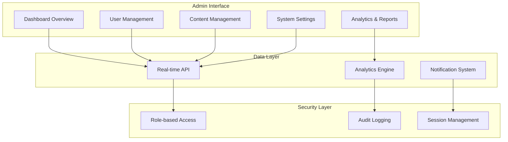

<div align="center">
  
  
  # MDAI Admin Dashboard
  
  **Enterprise Administrative Control Panel**
  
  [](https://github.com/mdai/admin/actions)
  [](https://mdai-admin.vercel.app)
  [](https://securityheaders.com/)
  [](https://reactjs.org/)
  [](https://www.typescriptlang.org/)
  
  [🚀 Live Dashboard](https://mdai-admin.vercel.app) • [📊 Analytics](https://analytics.mdai.com) • [🔧 System Status](https://status.mdai.com)
  
</div>

---

## Table of Contents

- [Overview](#overview)
- [Architecture](#architecture)
- [Quick Start](#quick-start)
- [Features](#features)
- [Security](#security)
- [Analytics](#analytics)
- [User Management](#user-management)
- [System Monitoring](#system-monitoring)
- [Deployment](#deployment)
- [Contributing](#contributing)

## Overview

The MDAI Admin Dashboard is a sophisticated administrative control panel designed for enterprise-level management of the MDAI e-learning platform. Built with modern React architecture, it provides comprehensive oversight, analytics, and control capabilities for platform administrators.

### Key Metrics

| Metric | Value | Target |
|--------|-------|--------|
| **Load Time** | 0.9s | <1.5s |
| **Bundle Size** | 180KB | <250KB |
| **Admin Actions/Min** | 500+ | 300+ |
| **Data Refresh Rate** | Real-time | <5s |
| **Security Score** | A+ | A |

### Administrative Capabilities

- 👥 **User Management**: Complete user lifecycle management
- 📚 **Content Oversight**: Course approval and moderation
- 📊 **Business Intelligence**: Advanced analytics and reporting
- 💰 **Financial Control**: Revenue tracking and payout management
- 🔒 **Security Management**: Access control and audit logs
- 🚨 **System Monitoring**: Real-time health and performance metrics
- 📧 **Communication Hub**: Automated notifications and messaging

## Architecture

### Admin Architecture



### Component Structure

```
admin/
├── 📁 public/                    # Static assets
│   ├── icons/                   # Admin-specific icons
│   ├── images/                  # Dashboard images
│   └── manifest.json            # PWA manifest
├── 📁 src/
│   ├── 📁 Auth/                 # Authentication components
│   │   └── Login/               # Admin login system
│   ├── 📁 components/           # Reusable components
│   │   └── Main/                # Core components
│   ├── 📁 Dashboard/            # Dashboard modules
│   │   ├── DashboardMain/       # Overview dashboard
│   │   ├── DashboardStudent/    # Student management
│   │   ├── DashboardTeacher/    # Teacher management
│   │   └── DashboardUser/       # User analytics
│   ├── 📁 pages/                # Page layouts
│   ├── 📁 routes/               # Route definitions
│   ├── 📁 utils/                # Utility functions
│   ├── App.jsx                  # Main application
│   └── main.jsx                 # Entry point
├── 📁 tests/                    # Test suites
├── 📁 docs/                     # Documentation
└── 📁 scripts/                  # Build scripts
```

## Quick Start

### Prerequisites

| Requirement | Version | Purpose |
|-------------|---------|---------|
| Node.js | ≥18.0.0 | Runtime environment |
| npm | ≥9.0.0 | Package manager |
| Admin Access | Required | Platform permissions |

### Development Setup

```bash
# Clone admin repository
git clone https://github.com/mdai/admin.git
cd admin

# Install dependencies
npm ci

# Setup environment
cp .env.example .env.local
npm run setup:admin

# Start development server
npm run dev
```

### Docker Setup

```bash
# Build admin container
docker build -t mdai-admin .
docker run -p 5174:5174 mdai-admin

# Or use Docker Compose
docker-compose up admin
```

### Environment Configuration

```bash
# .env.local
# API Configuration
VITE_BACKEND_URL=https://mdai-0jhi.onrender.com
VITE_API_VERSION=v1
VITE_ADMIN_API_KEY=admin_api_key_here

# Authentication
VITE_ADMIN_SESSION_TIMEOUT=3600000
VITE_ENABLE_2FA=true
VITE_ENABLE_AUDIT_LOGS=true

# Features
VITE_ENABLE_REAL_TIME=true
VITE_ENABLE_NOTIFICATIONS=true
VITE_ENABLE_ANALYTICS=true

# External Services
VITE_LOGO_URL=https://res.cloudinary.com/dp4ohisdc/image/upload/v1766995359/logo_odzmqw.jpg
VITE_SUPPORT_EMAIL=admin@mdai.com
VITE_SYSTEM_STATUS_URL=https://status.mdai.com

# Security
VITE_ENABLE_CSP=true
VITE_ENABLE_RATE_LIMITING=true
VITE_SESSION_ENCRYPTION=true
```

## Features

### 🏠 Dashboard Overview

#### Executive Summary
- **Key Performance Indicators**: Revenue, users, courses, engagement
- **Real-time Metrics**: Live user activity, system performance
- **Quick Actions**: Most common administrative tasks
- **Alert Center**: System notifications and urgent items

#### Activity Overview
```typescript
interface DashboardMetrics {
  totalUsers: number;
  activeUsers: number;
  totalCourses: number;
  publishedCourses: number;
  totalRevenue: number;
  monthlyGrowth: number;
  systemHealth: 'healthy' | 'warning' | 'critical';
  lastUpdated: Date;
}
```

### 👥 User Management

#### Student Management
- **User Profiles**: Complete student information and history
- **Enrollment Tracking**: Course progress and completion rates
- **Payment History**: Transaction records and refunds
- **Support Tickets**: Customer service integration
- **Behavioral Analytics**: Learning patterns and engagement

#### Teacher Management
- **Instructor Profiles**: Qualifications and performance metrics
- **Course Portfolio**: Teaching history and student feedback
- **Revenue Tracking**: Earnings and payout schedules
- **Performance Analytics**: Teaching effectiveness metrics
- **Certification Management**: Credential verification

#### Bulk Operations
```typescript
interface BulkUserOperation {
  operation: 'activate' | 'deactivate' | 'delete' | 'export';
  userIds: string[];
  reason?: string;
  scheduledAt?: Date;
  notifyUsers: boolean;
}
```

### 📚 Content Management

#### Course Oversight
- **Course Approval Workflow**: Review and publish process
- **Content Moderation**: Quality assurance and compliance
- **Category Management**: Course organization and taxonomy
- **Pricing Control**: Revenue optimization and promotions

#### Quality Assurance
- **Automated Checks**: Content validation and standards compliance
- **Manual Review**: Expert evaluation and feedback
- **Performance Monitoring**: Course effectiveness tracking
- **Student Feedback**: Review aggregation and analysis

### 📊 Analytics & Reporting

#### Business Intelligence
```typescript
interface AnalyticsData {
  userMetrics: {
    totalUsers: number;
    newUsers: number;
    activeUsers: number;
    churnRate: number;
  };
  courseMetrics: {
    totalCourses: number;
    completionRate: number;
    averageRating: number;
    popularCategories: string[];
  };
  revenueMetrics: {
    totalRevenue: number;
    monthlyRecurring: number;
    averageOrderValue: number;
    refundRate: number;
  };
}
```

#### Custom Reports
- **Financial Reports**: Revenue, expenses, profit margins
- **User Reports**: Demographics, behavior, satisfaction
- **Course Reports**: Performance, engagement, completion
- **System Reports**: Performance, security, compliance

### 🔒 Security & Compliance

#### Access Control
- **Role-based Permissions**: Granular access management
- **Multi-factor Authentication**: Enhanced security protocols
- **Session Management**: Secure session handling
- **Audit Trails**: Complete action logging

#### Compliance Management
- **GDPR Compliance**: Data protection and privacy
- **SOC 2 Controls**: Security and availability standards
- **PCI DSS**: Payment card data security
- **Regular Audits**: Automated compliance checking

## Security

### Authentication & Authorization

```typescript
interface AdminUser {
  id: string;
  email: string;
  role: 'super_admin' | 'admin' | 'moderator';
  permissions: Permission[];
  lastLogin: Date;
  mfaEnabled: boolean;
  sessionTimeout: number;
}

interface Permission {
  resource: string;
  actions: ('create' | 'read' | 'update' | 'delete')[];
  conditions?: Record<string, any>;
}
```

### Security Measures

| Layer | Implementation | Status |
|-------|----------------|--------|
| **Authentication** | Multi-factor Authentication | ✅ |
| **Authorization** | Role-based Access Control | ✅ |
| **Session Security** | Encrypted sessions with timeout | ✅ |
| **Data Encryption** | End-to-end encryption | ✅ |
| **Audit Logging** | Complete action tracking | ✅ |
| **Network Security** | VPN and IP whitelisting | ✅ |

### Audit System

```typescript
interface AuditLog {
  id: string;
  userId: string;
  action: string;
  resource: string;
  resourceId?: string;
  changes?: Record<string, any>;
  ipAddress: string;
  userAgent: string;
  timestamp: Date;
  severity: 'low' | 'medium' | 'high' | 'critical';
}
```

## Analytics

### Real-time Dashboard

#### Key Metrics Display
```typescript
interface RealTimeMetrics {
  activeUsers: number;
  ongoingCourses: number;
  systemLoad: number;
  errorRate: number;
  responseTime: number;
  revenue: {
    today: number;
    thisMonth: number;
    growth: number;
  };
}
```

#### Data Visualization
- **Interactive Charts**: Revenue trends, user growth, course performance
- **Heat Maps**: User activity patterns, geographic distribution
- **Funnel Analysis**: Conversion rates, drop-off points
- **Cohort Analysis**: User retention and lifetime value

### Business Intelligence

#### Advanced Analytics
```typescript
interface BusinessMetrics {
  customerAcquisition: {
    cost: number;
    channels: Record<string, number>;
    conversion: number;
  };
  customerLifetime: {
    value: number;
    duration: number;
    churnPrediction: number;
  };
  coursePerformance: {
    completion: number;
    satisfaction: number;
    revenue: number;
  };
}
```

## User Management

### User Lifecycle Management

#### Student Management Interface
```typescript
interface StudentManagement {
  profile: {
    personalInfo: UserProfile;
    enrollments: Enrollment[];
    payments: Payment[];
    support: SupportTicket[];
  };
  actions: {
    suspend: (reason: string) => Promise<void>;
    refund: (amount: number, reason: string) => Promise<void>;
    sendMessage: (message: string) => Promise<void>;
    exportData: () => Promise<Blob>;
  };
}
```

#### Teacher Management Interface
```typescript
interface TeacherManagement {
  profile: {
    qualifications: Certification[];
    courses: Course[];
    earnings: EarningsReport;
    performance: TeacherMetrics;
  };
  actions: {
    verify: () => Promise<void>;
    suspend: (reason: string) => Promise<void>;
    payout: (amount: number) => Promise<void>;
    sendNotification: (message: string) => Promise<void>;
  };
}
```

### Bulk Operations

#### Mass User Actions
- **Bulk Enrollment**: Enroll multiple users in courses
- **Bulk Communication**: Send messages to user segments
- **Bulk Data Export**: Generate user reports
- **Bulk Status Changes**: Activate/deactivate accounts

## System Monitoring

### Health Monitoring

#### System Health Dashboard
```typescript
interface SystemHealth {
  api: {
    status: 'healthy' | 'degraded' | 'down';
    responseTime: number;
    errorRate: number;
  };
  database: {
    status: 'healthy' | 'degraded' | 'down';
    connections: number;
    queryTime: number;
  };
  services: {
    email: ServiceStatus;
    payments: ServiceStatus;
    storage: ServiceStatus;
  };
}
```

#### Performance Metrics
- **Response Times**: API endpoint performance
- **Error Rates**: System reliability metrics
- **Resource Usage**: CPU, memory, storage utilization
- **User Experience**: Page load times, interaction delays

### Alert Management

#### Alert Configuration
```typescript
interface AlertRule {
  id: string;
  name: string;
  condition: string;
  threshold: number;
  severity: 'info' | 'warning' | 'error' | 'critical';
  channels: ('email' | 'sms' | 'slack' | 'webhook')[];
  enabled: boolean;
}
```

## Deployment

### Production Environment

```yaml
# docker-compose.admin.yml
version: '3.8'
services:
  admin:
    build: .
    ports:
      - "5174:5174"
    environment:
      - NODE_ENV=production
      - VITE_BACKEND_URL=https://mdai-0jhi.onrender.com
    restart: unless-stopped
    
  nginx:
    image: nginx:alpine
    ports:
      - "443:443"
    volumes:
      - ./nginx.admin.conf:/etc/nginx/nginx.conf
      - ./ssl:/etc/nginx/ssl
    depends_on:
      - admin
    restart: unless-stopped
```

### CI/CD Pipeline

```yaml
# .github/workflows/admin-deploy.yml
name: Deploy Admin Dashboard

on:
  push:
    branches: [main]
    paths: ['admin/**']

jobs:
  security-scan:
    runs-on: ubuntu-latest
    steps:
      - uses: actions/checkout@v3
      - name: Security Audit
        run: |
          npm audit --audit-level high
          npm run security:scan
          
  build-test:
    runs-on: ubuntu-latest
    steps:
      - uses: actions/checkout@v3
      - uses: actions/setup-node@v3
        with:
          node-version: '18'
      - run: npm ci
      - run: npm run test:admin
      - run: npm run build:admin
      
  deploy:
    needs: [security-scan, build-test]
    runs-on: ubuntu-latest
    steps:
      - name: Deploy to Vercel
        uses: vercel/action@v1
        with:
          vercel-token: ${{ secrets.VERCEL_TOKEN }}
          vercel-project-id: ${{ secrets.VERCEL_ADMIN_PROJECT_ID }}
```

### Environment-Specific Configurations

```bash
# Production
VITE_NODE_ENV=production
VITE_BACKEND_URL=https://mdai-0jhi.onrender.com
VITE_ENABLE_ANALYTICS=true
VITE_ENABLE_ERROR_REPORTING=true

# Staging
VITE_NODE_ENV=staging
VITE_BACKEND_URL=https://staging-api.mdai.com
VITE_ENABLE_DEBUG=true

# Development
VITE_NODE_ENV=development
VITE_BACKEND_URL=http://localhost:3000
VITE_ENABLE_DEBUG=true
VITE_ENABLE_HOT_RELOAD=true
```

## Contributing

### Development Workflow

```bash
# 1. Create admin feature branch
git checkout -b feature/admin-user-analytics

# 2. Make changes
# ... admin-specific changes ...

# 3. Run admin tests
npm run test:admin
npm run lint:admin
npm run security:check

# 4. Commit with admin prefix
git commit -m "feat(admin): add user analytics dashboard"

# 5. Push and create PR
git push origin feature/admin-user-analytics
```

### Admin-Specific Guidelines

1. **Security First**: All admin features must pass security review
2. **Audit Trail**: Every admin action must be logged
3. **Permission Checks**: Implement granular permission validation
4. **Data Protection**: Handle sensitive data with encryption
5. **Performance**: Optimize for large datasets and real-time updates

### Code Review Checklist

- ✅ **Security**: No sensitive data exposure
- ✅ **Permissions**: Proper role-based access control
- ✅ **Audit Logging**: All actions are tracked
- ✅ **Performance**: Optimized for admin workloads
- ✅ **UX**: Intuitive admin interface design
- ✅ **Testing**: Comprehensive test coverage
- ✅ **Documentation**: Updated admin documentation

### Admin Component Template

```typescript
// components/admin/UserManagement.tsx
import React, { useState, useEffect } from 'react';
import { useAdminAuth } from '@/hooks/useAdminAuth';
import { useAuditLog } from '@/hooks/useAuditLog';

interface UserManagementProps {
  permissions: Permission[];
}

export const UserManagement: React.FC<UserManagementProps> = ({ permissions }) => {
  const { user, hasPermission } = useAdminAuth();
  const { logAction } = useAuditLog();
  const [users, setUsers] = useState<User[]>([]);

  const handleUserAction = async (userId: string, action: string) => {
    if (!hasPermission('users', action)) {
      throw new Error('Insufficient permissions');
    }

    try {
      await performUserAction(userId, action);
      await logAction({
        action,
        resource: 'user',
        resourceId: userId,
        severity: 'medium'
      });
    } catch (error) {
      console.error('User action failed:', error);
    }
  };

  return (
    <div className="admin-user-management">
      {/* Admin UI components */}
    </div>
  );
};
```

---

<div align="center">
  
  **Built with ❤️ for enterprise-grade administration**
  
  [🚀 Live Dashboard](https://mdai-admin.vercel.app) • [📊 System Status](https://status.mdai.com) • [🔒 Security Center](https://security.mdai.com)
  
</div>