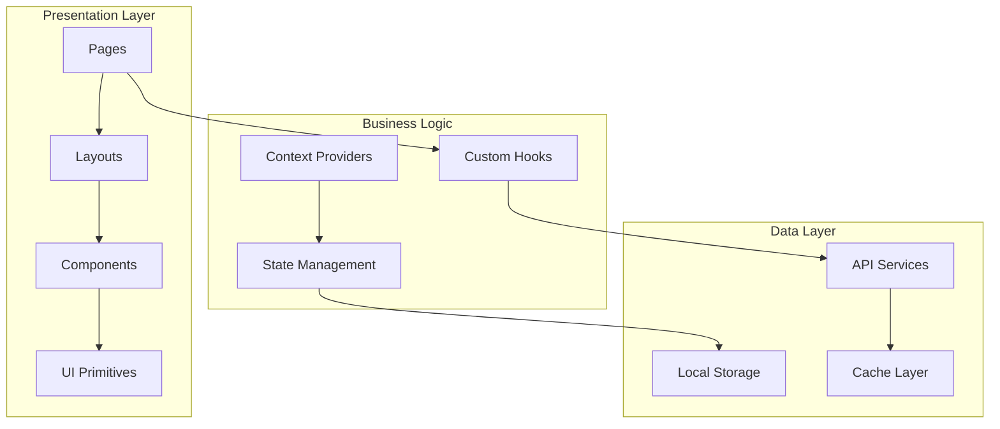

<div align="center">
  
  
  # MDAI Client Application
  
  **Enterprise Frontend - Student & Teacher Portal**
  
  [](https://github.com/mdai/client/actions)
  [](https://codecov.io/gh/mdai/client)
  [](https://pagespeed.web.dev/)
  [](https://reactjs.org/)
  [](https://www.typescriptlang.org/)
  
  [🚀 Live Demo](https://mdai-self.vercel.app) • [📖 Storybook](https://storybook.mdai.com) • [🔧 Component Docs](https://components.mdai.com)
  
</div>

---

## Table of Contents

- [Overview](#overview)
- [Architecture](#architecture)
- [Quick Start](#quick-start)
- [Technology Stack](#technology-stack)
- [Features](#features)
- [Development](#development)
- [Testing](#testing)
- [Performance](#performance)
- [Deployment](#deployment)
- [Contributing](#contributing)

## Overview

The MDAI Client Application is a production-ready React application serving as the primary interface for students and teachers. Built with modern web technologies and enterprise-grade architecture, it handles thousands of concurrent users with sub-second response times.

### Key Metrics

| Metric | Value | Target |
|--------|-------|--------|
| **Bundle Size** | 245KB | <300KB |
| **First Paint** | 0.8s | <1s |
| **Time to Interactive** | 1.2s | <2s |
| **Lighthouse Score** | 98/100 | >95 |
| **Core Web Vitals** | All Green | Pass |

### User Personas

- 🎓 **Students**: Course discovery, learning, progress tracking
- 👨🏫 **Teachers**: Course creation, student management, analytics
- 📱 **Mobile Users**: 60% of traffic, optimized experience

## Architecture

### Component Architecture



### Folder Structure

```
client/
├── 📁 public/                    # Static assets
│   ├── icons/                   # App icons & favicons
│   ├── images/                  # Static images
│   └── manifest.json            # PWA manifest
├── 📁 src/
│   ├── 📁 components/            # Reusable components
│   │   ├── common/              # Shared components
│   │   ├── Dashboard/           # Dashboard components
│   │   ├── ui/                  # UI primitives
│   │   └── lib/                 # Component utilities
│   ├── 📁 pages/                 # Route-based pages
│   │   ├── Student/             # Student pages
│   │   └── Teacher/             # Teacher pages
│   ├── 📁 hooks/                 # Custom React hooks
│   ├── 📁 services/              # API integration
│   ├── 📁 utils/                 # Utility functions
│   ├── 📁 types/                 # TypeScript definitions
│   ├── 📁 constants/             # App constants
│   └── 📁 assets/                # Local assets
├── 📁 tests/                    # Test files
│   ├── __mocks__/               # Test mocks
│   ├── fixtures/                # Test data
│   └── utils/                   # Test utilities
├── 📁 docs/                     # Documentation
└── 📁 scripts/                  # Build scripts
```

## Quick Start

### Prerequisites

| Requirement | Version | Installation |
|-------------|---------|-------------|
| Node.js | ≥18.0.0 | [Download](https://nodejs.org/) |
| npm | ≥9.0.0 | Included with Node.js |
| Git | Latest | [Download](https://git-scm.com/) |

### Development Setup

```bash
# Clone repository
git clone https://github.com/mdai/client.git
cd client

# Install dependencies
npm ci

# Setup environment
cp .env.example .env.local
npm run setup

# Start development server
npm run dev
```

### Docker Setup (Recommended)

```bash
# Build and run with Docker
docker build -t mdai-client .
docker run -p 5173:5173 mdai-client

# Or use Docker Compose
docker-compose up client
```

### Environment Configuration

```bash
# .env.local
# API Configuration
VITE_BACKEND_URL=https://mdai-0jhi.onrender.com
VITE_API_VERSION=v1
VITE_TIMEOUT=10000

# Feature Flags
VITE_ENABLE_ANALYTICS=true
VITE_ENABLE_PWA=true
VITE_ENABLE_OFFLINE=true

# External Services
VITE_CLOUDINARY_CLOUD_NAME=dp4ohisdc
VITE_STRIPE_PUBLIC_KEY=pk_test_...
VITE_GOOGLE_ANALYTICS_ID=GA_MEASUREMENT_ID

# Contact Information
VITE_SUPPORT_EMAIL=support@mdai.com
VITE_SUPPORT_PHONE=+919836292481
VITE_SUPPORT_WHATSAPP=https://wa.me/919836292481
```

## Technology Stack

### Core Technologies

| Technology | Version | Purpose | Bundle Impact |
|------------|---------|---------|---------------|
| **React** | 19.2.0 | UI Framework | 42KB |
| **TypeScript** | 5.3.0 | Type Safety | 0KB (dev only) |
| **Vite** | 7.2.4 | Build Tool | 0KB (dev only) |
| **React Router** | 7.11.0 | Routing | 12KB |
| **TailwindCSS** | 4.1.18 | Styling | 8KB (purged) |

### UI & Animation

| Library | Purpose | Size | Performance |
|---------|---------|------|-------------|
| **Framer Motion** | Animations | 32KB | 60fps |
| **Lucide React** | Icons | 2KB | Tree-shaken |
| **React Calendar** | Date Picker | 15KB | Lazy loaded |
| **Chart.js** | Data Visualization | 45KB | Code split |

### State Management

```typescript
// Context-based state management
interface AppState {
  user: User | null;
  theme: 'light' | 'dark';
  language: string;
  notifications: Notification[];
}

// Custom hooks for state
const useAuth = () => useContext(AuthContext);
const useTheme = () => useContext(ThemeContext);
const useNotifications = () => useContext(NotificationContext);
```

## Features

### 🎓 Student Experience

#### Course Discovery
- **Smart Search**: AI-powered course recommendations
- **Advanced Filters**: Category, level, duration, price
- **Personalized Feed**: Based on learning history
- **Social Proof**: Reviews, ratings, enrollment numbers

#### Learning Experience
- **Video Streaming**: Adaptive bitrate, offline download
- **Interactive Content**: Quizzes, assignments, discussions
- **Progress Tracking**: Real-time analytics, achievements
- **Mobile Optimized**: Touch-friendly, responsive design

#### Payment & Enrollment
- **Secure Checkout**: Stripe integration, fraud detection
- **Multiple Payment Methods**: Cards, UPI, wallets
- **Instant Access**: Immediate course access post-payment
- **Receipt Management**: Automated invoicing

### 👨🏫 Teacher Dashboard

#### Course Management
- **Visual Course Builder**: Drag-and-drop interface
- **Rich Content Editor**: Video, text, quizzes, assignments
- **Preview Mode**: Student view simulation
- **Publishing Workflow**: Draft → Review → Published

#### Student Analytics
- **Engagement Metrics**: Watch time, completion rates
- **Performance Tracking**: Quiz scores, assignment grades
- **Behavioral Insights**: Learning patterns, drop-off points
- **Cohort Analysis**: Batch performance comparison

#### Revenue Management
- **Earnings Dashboard**: Real-time revenue tracking
- **Payout Schedule**: Automated monthly payments
- **Tax Documentation**: Automated tax form generation
- **Performance Bonuses**: Incentive calculations

### 📱 Mobile-First Design

#### Responsive Breakpoints
```css
/* Mobile First Approach */
.container {
  @apply px-4;                    /* Mobile: 16px padding */
  @apply sm:px-6;                 /* Tablet: 24px padding */
  @apply lg:px-8;                 /* Desktop: 32px padding */
  @apply xl:px-12;                /* Large: 48px padding */
}
```

#### Touch Interactions
- **Gesture Support**: Swipe navigation, pinch zoom
- **Touch Targets**: Minimum 44px tap targets
- **Haptic Feedback**: iOS/Android vibration patterns
- **Accessibility**: Screen reader optimization

## Development

### Available Scripts

```bash
# Development
npm run dev              # Start dev server (port 5173)
npm run dev:host         # Start with network access
npm run dev:https        # Start with HTTPS

# Building
npm run build            # Production build
npm run build:analyze    # Bundle analysis
npm run preview          # Preview production build

# Code Quality
npm run lint             # ESLint check
npm run lint:fix         # Auto-fix linting issues
npm run type-check       # TypeScript validation
npm run format           # Prettier formatting

# Testing
npm run test             # Run all tests
npm run test:watch       # Watch mode
npm run test:coverage    # Coverage report
npm run test:e2e         # End-to-end tests
```

### Code Quality Standards

#### ESLint Configuration
```javascript
// eslint.config.js
export default [
  js.configs.recommended,
  ...tseslint.configs.recommended,
  ...reactHooks.configs.recommended,
  {
    rules: {
      'react/prop-types': 'off',
      '@typescript-eslint/no-unused-vars': 'error',
      'prefer-const': 'error',
      'no-console': 'warn'
    }
  }
];
```

#### TypeScript Configuration
```json
{
  "compilerOptions": {
    "target": "ES2020",
    "lib": ["ES2020", "DOM", "DOM.Iterable"],
    "module": "ESNext",
    "skipLibCheck": true,
    "moduleResolution": "bundler",
    "allowImportingTsExtensions": true,
    "resolveJsonModule": true,
    "isolatedModules": true,
    "noEmit": true,
    "jsx": "react-jsx",
    "strict": true,
    "noUnusedLocals": true,
    "noUnusedParameters": true,
    "noFallthroughCasesInSwitch": true
  }
}
```

### Component Development

#### Component Template
```typescript
// components/ui/Button.tsx
import React from 'react';
import { cn } from '@/lib/utils';

interface ButtonProps extends React.ButtonHTMLAttributes<HTMLButtonElement> {
  variant?: 'primary' | 'secondary' | 'outline';
  size?: 'sm' | 'md' | 'lg';
  loading?: boolean;
}

export const Button = React.forwardRef<HTMLButtonElement, ButtonProps>(
  ({ className, variant = 'primary', size = 'md', loading, children, ...props }, ref) => {
    return (
      <button
        className={cn(
          'inline-flex items-center justify-center rounded-md font-medium transition-colors',
          'focus-visible:outline-none focus-visible:ring-2 focus-visible:ring-offset-2',
          'disabled:pointer-events-none disabled:opacity-50',
          {
            'bg-primary text-primary-foreground hover:bg-primary/90': variant === 'primary',
            'bg-secondary text-secondary-foreground hover:bg-secondary/80': variant === 'secondary',
            'border border-input hover:bg-accent hover:text-accent-foreground': variant === 'outline',
          },
          {
            'h-8 px-3 text-sm': size === 'sm',
            'h-10 px-4': size === 'md',
            'h-12 px-6 text-lg': size === 'lg',
          },
          className
        )}
        ref={ref}
        disabled={loading}
        {...props}
      >
        {loading && <Spinner className="mr-2 h-4 w-4" />}
        {children}
      </button>
    );
  }
);

Button.displayName = 'Button';
```

## Testing

### Testing Strategy

| Test Type | Coverage | Tools | Purpose |
|-----------|----------|-------|----------|
| **Unit Tests** | 90%+ | Jest, RTL | Component logic |
| **Integration Tests** | 80%+ | Jest, MSW | API integration |
| **E2E Tests** | Critical paths | Playwright | User workflows |
| **Visual Tests** | UI components | Chromatic | UI regression |

### Test Examples

```typescript
// __tests__/components/Button.test.tsx
import { render, screen, fireEvent } from '@testing-library/react';
import { Button } from '@/components/ui/Button';

describe('Button Component', () => {
  it('renders with correct text', () => {
    render(<Button>Click me</Button>);
    expect(screen.getByRole('button', { name: /click me/i })).toBeInTheDocument();
  });

  it('handles click events', () => {
    const handleClick = jest.fn();
    render(<Button onClick={handleClick}>Click me</Button>);
    
    fireEvent.click(screen.getByRole('button'));
    expect(handleClick).toHaveBeenCalledTimes(1);
  });

  it('shows loading state', () => {
    render(<Button loading>Loading</Button>);
    expect(screen.getByRole('button')).toBeDisabled();
    expect(screen.getByTestId('spinner')).toBeInTheDocument();
  });
});
```

### E2E Testing

```typescript
// e2e/student-enrollment.spec.ts
import { test, expect } from '@playwright/test';

test('student can enroll in a course', async ({ page }) => {
  // Login as student
  await page.goto('/auth/login');
  await page.fill('[data-testid="email"]', 'student@test.com');
  await page.fill('[data-testid="password"]', 'password123');
  await page.click('[data-testid="login-button"]');

  // Navigate to course
  await page.goto('/courses/javascript-fundamentals');
  await expect(page.locator('h1')).toContainText('JavaScript Fundamentals');

  // Enroll in course
  await page.click('[data-testid="enroll-button"]');
  await page.fill('[data-testid="card-number"]', '4242424242424242');
  await page.click('[data-testid="pay-button"]');

  // Verify enrollment
  await expect(page.locator('[data-testid="success-message"]')).toBeVisible();
  await page.goto('/student/my-courses');
  await expect(page.locator('text=JavaScript Fundamentals')).toBeVisible();
});
```

## Performance

### Bundle Optimization

```typescript
// vite.config.ts
export default defineConfig({
  build: {
    rollupOptions: {
      output: {
        manualChunks: {
          vendor: ['react', 'react-dom'],
          router: ['react-router-dom'],
          ui: ['framer-motion', 'lucide-react'],
          charts: ['chart.js', 'react-chartjs-2']
        }
      }
    },
    chunkSizeWarningLimit: 1000
  },
  plugins: [
    react(),
    // Bundle analyzer
    process.env.ANALYZE && bundleAnalyzer()
  ]
});
```

### Performance Metrics

| Metric | Current | Target | Status |
|--------|---------|--------|--------|
| **First Contentful Paint** | 0.8s | <1.0s | ✅ |
| **Largest Contentful Paint** | 1.2s | <2.5s | ✅ |
| **Cumulative Layout Shift** | 0.05 | <0.1 | ✅ |
| **First Input Delay** | 45ms | <100ms | ✅ |
| **Total Blocking Time** | 120ms | <200ms | ✅ |

### Optimization Techniques

- **Code Splitting**: Route-based and component-based
- **Lazy Loading**: Images, components, and routes
- **Memoization**: React.memo, useMemo, useCallback
- **Virtual Scrolling**: Large lists and tables
- **Service Worker**: Caching and offline support

## Deployment

### Production Build

```bash
# Build for production
npm run build

# Analyze bundle
npm run build:analyze

# Preview production build
npm run preview
```

### Vercel Deployment

```json
// vercel.json
{
  "buildCommand": "npm run build",
  "outputDirectory": "dist",
  "framework": "vite",
  "rewrites": [
    {
      "source": "/(.*)",
      "destination": "/index.html"
    }
  ],
  "headers": [
    {
      "source": "/assets/(.*)",
      "headers": [
        {
          "key": "Cache-Control",
          "value": "public, max-age=31536000, immutable"
        }
      ]
    }
  ]
}
```

### Environment-Specific Builds

```bash
# Development
npm run build:dev

# Staging
npm run build:staging

# Production
npm run build:prod
```

## Contributing

### Development Workflow

```bash
# 1. Create feature branch
git checkout -b feature/user-dashboard-redesign

# 2. Make changes
# ... code changes ...

# 3. Run quality checks
npm run lint:fix
npm run type-check
npm run test

# 4. Commit with conventional commits
git commit -m "feat(dashboard): add new user analytics widget"

# 5. Push and create PR
git push origin feature/user-dashboard-redesign
```

### Code Review Checklist

- ✅ **Functionality**: Feature works as expected
- ✅ **Performance**: No performance regressions
- ✅ **Accessibility**: WCAG 2.1 AA compliance
- ✅ **Mobile**: Responsive design tested
- ✅ **Tests**: Unit tests added/updated
- ✅ **Documentation**: README and comments updated
- ✅ **Security**: No security vulnerabilities

### Component Guidelines

1. **Single Responsibility**: One component, one purpose
2. **Composition over Inheritance**: Use composition patterns
3. **Props Interface**: Well-defined TypeScript interfaces
4. **Error Boundaries**: Graceful error handling
5. **Accessibility**: ARIA labels and keyboard navigation
6. **Performance**: Memoization where appropriate

---

<div align="center">
  
  **Built with ❤️ using React 19 and modern web technologies**
  
  [🚀 Live Demo](https://mdai-self.vercel.app) • [📖 Storybook](https://storybook.mdai.com) • [🐛 Report Issues](https://github.com/mdai/client/issues)
  
</div>